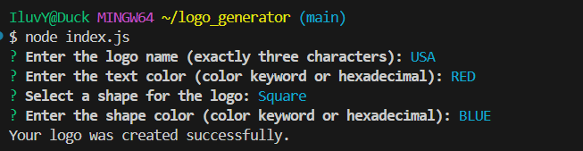

# SVG Logo Gen 

## Description

The SVG Logo Maker is a command-line application built with Node.js that generates customizable logos based on user input. It uses object-oriented programming principles to create shape objects, including triangles, squares, and circles, which form the basis of the logo design.

## Table of Contents

- [Description](#description)
- [Installation](#installation)
- [Usage](#usage)
- [License](#license)
- [Contributing](#contributing)
- [Tests](#tests)
- [Questions](#questions)

## Installation

Clone repo from https://github.com/erinspix/logo_generator.git
and use "npm install" to install dependancies.

## Usage

In the terminal, execute "node index.js"
answer prompts in  terminal, s, such as the text you want on your logo, the text color, the shape type, and the shape color, to create logo.
## License

This project is licensed under the MIT license.

## Contributing
yes.
I never know what to put here.
-_-

## Tests

to test, open terminal and use "npm test"

## Questions

For any questions, please contact me with the information below:

GitHub: [erinspix](https://github.com/erinspix)  
Email: e.spix@yahoo.com

- **terminal**: 
- **Logo**: 
